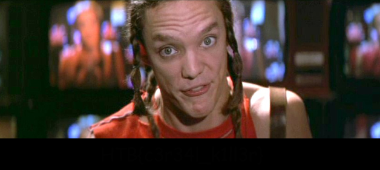

## Solution
If you open the picture you see a (suspicious) black part at the bottom:


After negating the colors something comes up on that part of the image:
```bash
$ convert -negate widescreen.png widescreen.negated.png
```


To see clearly what's in there, convert can change the *clear* white to something that can be uses to distinguish the flag (in a light grey/almost white):
 ```bash
 $ convert -fill red -opaque white widescreen.negated.png widescreen.flag.png
 ```
 
 
